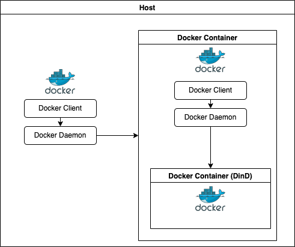
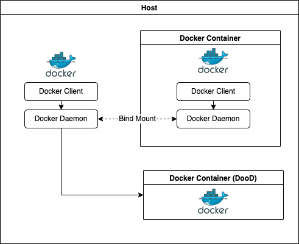

### Docker Conainer 내부에서 Docker가 필요한 상황
---

- 종종 Docker 컨테이너 내부에 Docker를 실행해야하는 상황이 있다. 하지만 docker 컨테이너는 호스트와 격리되어 있기 때문에 호스트에 docker가 설치되어 있다고해서 docker 컨테이너 내부에서 docker를 사용할 수는 없다.
> 현재 내가 다니고 있는 회사에서는 개발 젠킨스의 경우 docker를 이용하여 실행중인데, 스프링 테스트 컨테이너를 실행하는 도중 젠킨스 컨테이너 내부에 docker가 존재하지 않아 오류가 발생하였다.
- 때문에 docker 컨테이너 내부에서 docker를 실행하기 위한 어떠한 방법이 필요한데 이러한 해결 방법이 DinD(Docker in Docker), DooD(Docker out of Docker)이다.

### 2. Docker Architecture
---

- DinD와 DooD를 구성하는 방법을 확인하기 전에 Docker Architecture에 대해서 먼저 알아보자.


1. Docker Client (docker)
   - Docker Client는 Docker 사용자가 Docker와 상호작용할 수 있는 인터페이스 역할을 한다. 
   - 사용자가 docker 명령어를 입력하면 Docker Daemon과 통신하여 필요한 명령을 수행할 수 있는 입력 창구같은 역항를 한다.
2. Docker Deamon (dockerd)
   - Docker Daemon은 Docker Client로 부터 들어온 요청을 수신하여, Docker를 구성하는 객체(이미지, 컨테이너, 볼륨...)를 관리한다.
3. Registry
   - Registry는 Docker Hub나 호스트에 이미지를 저장하고 사용자가 이미지를 사용할 수 있도록 하는 저장소이다.

> 정리하자면 Docker Client를 통해서 Docker 명령어를 입력하면 Docker Daemon에서 요청을 받아 명령을 수행하고, Docker와 관련된 이미지는 Registry에서 받아온다.

- DinD와 DooD의 차이점은 컨테이너 내부의 Docker Daemon을 사용할지, 호스트에 있는 Docker Daemon을 사용할지에 따라 나뉜다.  

### 3. DinD (Docker in Docker)
---



- DinD는 Docker container 내부에 또 다른 Docker container를 실행시키는 방법이다. 
  - Docker Container 내부에 호스트와 완전히 격리된 Docker를 사용할 수 있다.
- DinD를 방시을 사용하여 Docker Container 내부에 Docker를 실행하게 되면 호스트와 다른 버전을 가진 Docker 설치가 가능하기 때문에 완전히 격리된 환경에서 실행하는 것을 원하면 DinD를 사용하는 것이 좋은 해결방안이 될 수 있다. 

#### 3.1. DinD의 단점

- 호스트의 Docker 활용 불가
  - 컨테이너 내부에 호스트와 격리된 Docker를 가진다는 의미는 호스트가 이미 가지고 있는 이미지를 사용할 수 없다는 의미이다. 호스트의 `/var/lib/docker` 폴더를 컨테이너가 bind mount하는 방법이 있지만 해당 방법은 정상 동작하지 않을 가능성이 있다.
  - 애초에 호스트와 동일한 이미지를 사용하기를 원한다면 DinD가 아닌 DooD 방식을 사용하는 것이 좋다.
- previleged 옵션으로 인한 보안 문제
  - DinD방식으로 Docker Container 내부에 Docker를 실행하기를 원한다면 previleged 옵션을 true로 줘야하는데 이는 보안상 문제가 있다고 한다. 어떤 보안 문제가 있는지는 잘 모르겠다.
  > https://docs.docker.com/engine/reference/run/#runtime-privilege-and-linux-capabilities


#### 3.2. DinD 방식을 활용하여 Jenkins Container 내부에 Docker 실행

```yaml
version: '3'
services:
  docker:
    image: docker:dind
    privileged: true
    environment:
      - DOCKER_TLS_CERTDIR=/certs
    volumes:
      - ./certs/client:/certs/client
    ports:
      - 2376:2376
  jenkins:
    build:
      context: .
    environment:
      - TZ=Asia/Seoul
      - DOCKER_HOST=tcp://docker:2376
      - DOCKER_CERT_PATH=/certs/client
      - DOCKER_TLS_VERIFY=1
    ports:
      - 8080:8080
      - 50000:50000
    volumes:
      - ./jenkins_home:/var/jenkins_home
      - ./certs/client:/certs/client:ro
    depends_on:
      - docker
```

> https://www.jenkins.io/doc/book/installing/docker/


### 4. DooD (Docker in Docker)
---



- DooD는 Docker container 밖에서 다른 Docker container를 실행시키는 방법이다.
- DinD 방식괴 다르게 호스트의 `/var/run/docker.sock`을 bind mount하고 있기 때문에 호스트와 동일한 Docker를 사용할 수 있다.
- DooD 방식으로 컨테이너를 실행하게 되면 permission에러가 발생하는데 해당 에러가 발생하는 원인은 호스트와 컨테이너의 Group ID의 차이때문에 발생한다.
- 때문에 정상 동작을 하기 위해서는 docker gid를 동일하게 맞춰 주어야하는데 Docker 이미지를 빌드할 때 추가적인 명령어를 통해서 해결할 수 있다.

```docker
ARG D_GROUP

RUN groupadd docker
RUN groupmod -g ${D_GROUP} docker
```
- 빌드 이후 컨테이너에 접속하여 /var/run/docker.sock이 root:docker로 되어있는지 확인해보자.
- (getent group docker | cut -d: -f3


> https://docs.docker.com/get-started/overview/#docker-architecture <br/>
> https://pyojuncode.github.io/Docker-DinD,-DooD/ <br/>
> https://docs.docker.com/engine/install/debian/ <br/>
> https://bitgadak.tistory.com/3 <br/>