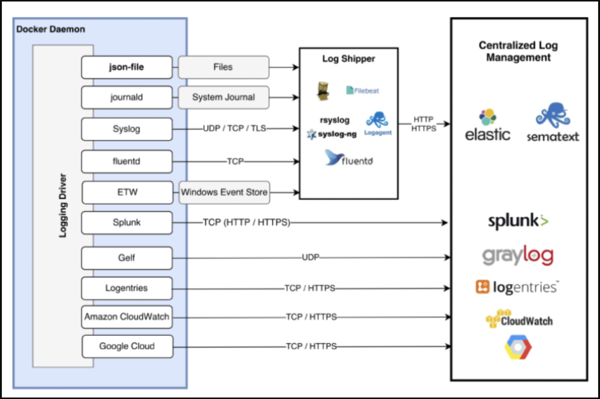

### Docker 컨테이너 로그
---



- 도커 컨테이너가 실행되면 `STDOUT (표준 출력), STDOUT (표준 에러)`을 통해서 로그 정보를 내보낸다.
- 도커는 ***실행 중인 컨테이너 및 서비스에서 정보를 얻는 데 도움이 되는 여러 로깅 메커니즘이 포함***되어 있다. 이러한 메커니즘을 로깅 드라이버라고 한다.
- 로깅 드라이버를 어떻게 구성하느냐에 따라서 메시지 형식과 파일형식으로 저장하할지 원격 서버에 있는 로그 저장소에 저장할지도 선택할 수 있다.
  - 개발자에게 로그가 없다면 에러 발생에 대한 원인 파악조차 안될 수 있기 때문에 로그는 중요하다.
- `docker logs` 명령문을 통하여 컨테이너가 기록중인 로그 정보를 확인할 수 있다.


> 현재 실무에서 Datadog을 통해서 Docker Container 로그를 수집하고 있으며, 도커 컨테이너 `STDOUT (표준 출력), STDOUT (표준 에러)`를 통해서 로그 정보를 Datadog에게 전송하고 있다.


### Docker 로그 명령어
---

```sh
### nginx 컨테이너 실행
docker run --name docker-nginx -p 80:80 -d nginx

### 전체 로그 확인
docker logs docker-nginx

### 마지막 10줄 로그 확인
docker logs --tail 10 docker-nginx

### 실시간 로그 스트림 확인
docker logs -f docker-nginx

### 로그 타임스탬프 표시
docker logs -f -t docker-nginx
```

### 호스트 운영체제의 로그 저장 경로
---

```sh

## Docker 로그 저장 경로
/var/lib/docker/containers/<container_id>/<container_id>-json.log

### Docker 
docker inspect -f "{{.LogPath}}" <container_id> 

```

#### Mac을 사용할 경우

- mac을 사용할 경우 로그 저자
```sh
nc -U ~/Library/Containers/com.docker.docker/Data/debug-shell.sock
```


### Docker 로그 관리
---

- 기본적으로 도커 컨테이너는 JSON 형식으로 로그를 저장하는 `json-file` 로깅 드라이버를 사용하고 있다.
  - `json-file`로깅 드라이버를 사용할 경우, ***파일 형식으로 호스트 PC에 로그가 저장되기 때문에 디스크 풀이 발생할 위험이 있어 과거 로그들을 주기적으로 삭제할 필요***가 있다. 
    - 도커 컨테이너 전체 로그 구성
      - 도커 데몬의 구성을 변경하면 생성되는 모든 컨테이너에 반영된다.
      - deamon.json 파일을 수정한 이후 도커 서비스를 재실행
          ```bash
          ### 리눅스
          sudo vi /etc/docker/daemon.json
          ### mac
          sudo ~/.docker/daemon.json
          ```
          ```json
          {
              "log-driver": "json-file",
              "log-opts": {
                  "max-size": "10m",
                  "max-file": "10"
              }
          }
          ```
          ```bash
          sudo systemctl restart docker
          ```
    - 도커 컨테이너별로 로그 설정 
      ```bash
      docker run -d \
          --log-driver json-file \
          --log-opt max-size=10m \
          --log-opt max-file=10 \
          --name docker-nginx -p 80:80 -d nginx
      ```
- `json-file` 로깅 드라이버 말고도 다양한 로깅 드라이버들이 존재한다.
  - 파일 형식으로 저장하는 것이 아닌, TCP,UDP, HTTP와 같은 프로토콜을 이용하여 로그를 전송하는 방식들도 있다.


> 로깅 드라이버 구성: https://docs.docker.com/config/containers/logging/configure/ <br/>
> Docker 로그 제대로 사용하기: https://insight.infograb.net/blog/2022/11/22/docker-logging-driver/