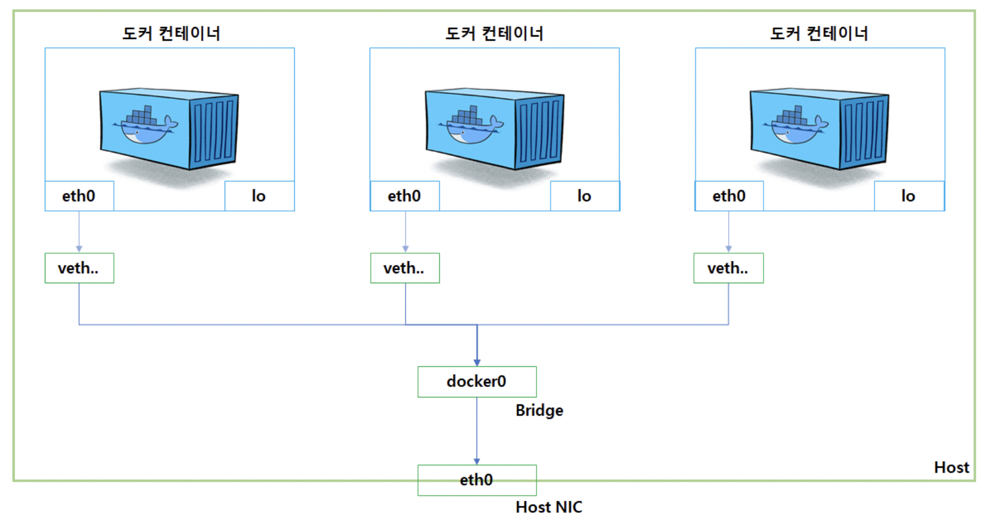
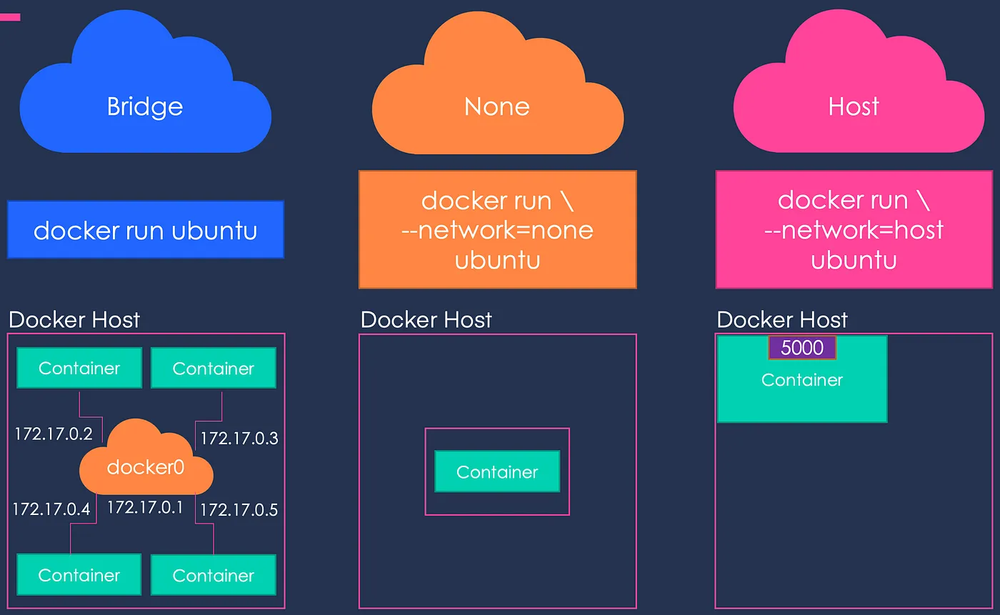

### 도커 네트워크
---

- Docker 컨테이너는 격리된 환경에서 실행되기 때문에 다른 컨테이너와 통신이 불가능하다.
- 하지만 Docker 네트워크 드라이버를 사용하면 서로 통신이 가능해진다.
    > 도커 설치 시 ***기본적으로 제공되는 docker0는 가상 이더넷 브리지(vitual ethernet bridge)*** 네트워크이며, 이것을 통해 격리된 컨테이너들의 상호 간 통신을 제공한다.

<br/>

#### 도커 브리지 네트워크를 통한 예시


- docker0: 도커 설치 시 기본적으로 제공되는 브리지 네트워크로 172.17.0.1 주소를 갖는다.
- veth: 컨테이너 내부에 제공되는 네티워크 인터페이스로 컨테이너와 eth0와 한쌍으로 제공되어 docker0와 가상의 터널링 네트워크를 제공한다.
- 도커 컨테이너는 시작될때 마다 veth라는 네트워크 인터페이스를 생성하여 docker0브리지를 통하여 호스트 eth0 인터페이스를 이어주는 역할을 한다.

- nginx 컨테이너 실행을 통해서 확인해보기
    ```bash
    ## nginx 컨테이너 실행
    docker run --name nginx -p 80:80 -d nginx
    ## nginx 컨테이너 정보
    docker inspect nginx
    ```
    ```json
    "NetworkSettings": {
        "Ports": {
            "80/tcp": [
                {
                    "HostIp": "0.0.0.0",
                    "HostPort": "80"
                }
            ]
        },
        "Gateway": "172.17.0.1",
        "IPAddress": "172.17.0.2",
    }
    ```
    - docker 컨테이너 내부에 172.17.0.2 IP가 할당되었으며 docker0(172.17.0.1)를 통해서 통신이 가능하다는 것을 확인할 수 있다.

> https://captcha.tistory.com/70

### 도커 네트워크 드라이버 종류
---

1. 단일 호스트 네트워킹


   - bridge
     - ***하나의 호스트 컴퓨터에 여러 컨테이너들이 서로 통신이 가능***하게 해준다.
     - 기본 네트워크 드라이버로 컨테이너 실행 시 별도의 지정 없을때는 bridge 네트워크를 사용한다.

   - host
      - ***호스트와 컨테이너 간에 격리를 없애고, 호스트의 네트워크를 직접 사용***할 수 있다.
      - 별도의 포트 연결 없어 호스트 포트를 바로 이용 가능하다.
   - none
      - ***컨테이너의 네트워크를 사용하지 않도록 설정***한다.
      - 컨테이너가 호스트 네트워크와 완전히 분리되어 외부와의 통신을 단절한다.

2. 사용자 정의 네트워크
   - ***사용자가 직접 생성한 네트워크***로 옵션을 주지 않고 생성하면 docker0 IP 대역과 다른 CIDR을 생성한다.
   - `docker create network`명령어를 통해서 생성 가능하다.
       ```bash
       ### docker network 생성, 드라이버 지정안할 시 bridge 네트워크 드라이버 사용
       docker network create docker-network

       ### docker network 리스트 확인
       docker network ls

       ### docker-network 상세 정보 확인
       ### 기본 bridge 네트워크와 서브넷이 다른것을 확인할 수 있다.
       docker network inspect docker-network

       ## 생성한 네트워크를 컨테이너에 연결 --net [네트워크 이름]
       docker run --name docker-network-nginx -p 81:80 -d --net docker-network nginx

       ## 컨테이너 및 네트워크 연결 정보 확인
       docker inspect docker-network-nginx
       docker network inspect docker-network
       ```
   - 특정 IP 대역을 할당하는 것도 가능하다. (--subnet, --ip-range, --gateway ...)
   - ***사용자 정의 네트워크로 구성된 컨테이너의 가장 큰 특징 중 하나는 컨테이너 이름을 상호 간의 연결 포인트로 사용***할 수 있다.
       ```bash
       ### 사용자 지정 네트워크로 nginx 컨테이너 2개 실행
       docker run --name docker-network-nginx -d --net docker-network nginx
       docker run --name docker-network-nginx2 -d --net docker-network nginx

       docker exec -it docker-network-nginx bin/bash
       curl docker-network-nginx2
       ```
3. 다중 호스트 네트워킹
   - overlay
     - 다중 호스트 도커 서버에서 돌아가는 컨테이너들간에 네트워킹을 위해서 사용된다.

### 네트워크와 컨테이너 연결
---

```bash
### 네트워크 연결
docker network connect [네트워크명] [컨테이너명]
docker run --net [네트워크명]

### 네트워크 연결 해제
docker network disconnect [네트워크명] [컨테이너명]

```
- 컨테이너에는 네트워크를 하나 이상 연결이 가능하다.


> https://www.daleseo.com/docker-networks/
> https://towardsdatascience.com/docker-networking-919461b7f498